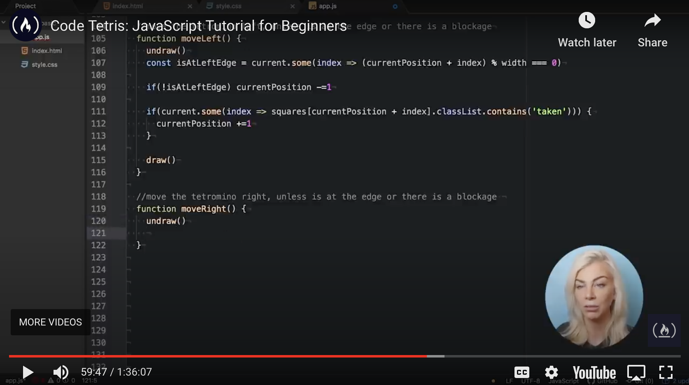

# Tetris Tutorial

An HTML-based Tetris game derived from a [tutorial](https://github.com/kubowania/Tetris) by @kubowania.

[](https://www.freecodecamp.org/news/learn-javascript-by-creating-a-tetris-game/)

My implementation may look a bit different in that I decided to refactor and try to pre-implement some of the features before watching the corresponding parts of the tutorial.

Even thought I have used JavaScript for some time, this tutorial still was a good practice and put me on making better use of the `Array.some()` method.

## Usage

```bash
npm install -g browser-sync
browser-sync -w .
```
